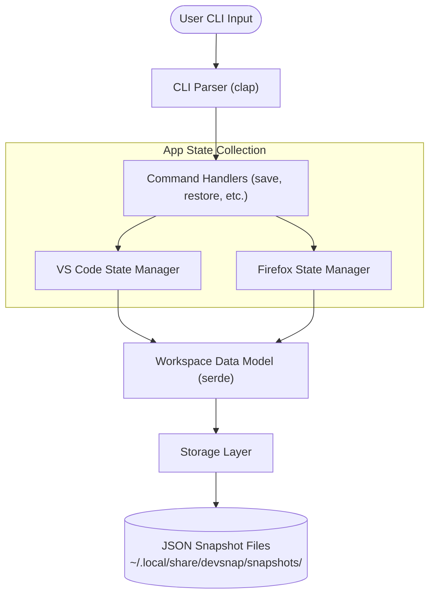

# DevSnap 📦

> A lightweight, fast CLI tool written in Rust to snapshot and restore your Linux dev workspaces in seconds.

---

## 📖 Overview & Motivation

If you're anything like me, you probably work on multiple projects at the same time. Before you know it, your desktop is a chaotic mess of open VS Code windows and Firefox tabs. Closing them feels like losing your flow, but keeping everything open bogs down your system.

**DevSnap** solves this exact problem. It lets you "freeze" your current development state into a lightweight, named snapshot and restore it whenever you're ready to jump back into that project.

### 💡 Why DevSnap?
Instead of relying on heavy background daemons or fragile desktop window manager hacks, DevSnap directly inspects native application configuration and session files (like VS Code workspace state and Firefox session stores). 

This makes DevSnap:
- **⚡ Super Fast**: Captures and restores states almost instantly by reading and writing files directly.
- **🐧 Portable across Linux**: Works cleanly across Linux setups without needing specific display server or window manager hooks.
- **📦 Clean & Lightweight**: Simple, local file-based snapshots stored right in your home directory.

### ✨ Key Features
- **Workspace Snapshots**: Save your active VS Code workspaces and Firefox tabs into named snapshots.
- **One-Command Restore**: Re-launch your apps and restore your exact project context in seconds.
- **Interactive CLI Prompts**: Friendly terminal selection menus when you want an interactive workflow.

---

## 🛠️ Tech Stack & Rust Ecosystem

DevSnap is built in **Rust** to leverage zero-cost abstractions, memory safety, and near-instant CLI execution times. 

Here's a breakdown of the awesome crates from the Rust ecosystem powering DevSnap:

| Crate | Purpose |
| :--- | :--- |
| [`clap`](https://crates.io/crates/clap) | Subcommand parsing (`init`, `save`, `restore`, `rewrite`, `delete`) using derive macros |
| [`serde`](https://crates.io/crates/serde) / [`serde_json`](https://crates.io/crates/serde_json) | Serializes structured workspace snapshot files to disk |
| [`inquire`](https://crates.io/crates/inquire) | Provides interactive terminal prompts and selection menus |
| [`sysinfo`](https://crates.io/crates/sysinfo) | Queries the system process table to inspect running application instances |
| [`rust-ini`](https://crates.io/crates/rust-ini) | Parses INI configuration files (e.g., Firefox profile paths) |
| [`lz4_flex`](https://crates.io/crates/lz4_flex) | High-performance LZ4 compression support for compact snapshot data |
| [`dirs`](https://crates.io/crates/dirs) | Cross-platform resolution of user directories (`~/.local/share/devsnap/`) |
| [`anyhow`](https://crates.io/crates/anyhow) | Idiomatic, flexible Rust error handling |

---

## 🏗️ Architecture & How It Works

DevSnap uses a modular, decoupled architecture where each supported application (VS Code, Firefox, etc.) has its own dedicated state manager.



### Module Breakdown
- **`cli.rs`**: Defines the command-line interface and subcommands using `clap`.
- **`handlers/`**: Contains command logic (`save`, `restore`, `delete`, `rewrite`) and interactive selection menus (`inquire`).
- **`apps_state_manager/`**: App-specific state extraction modules (`firefox`, `vscode`) for capturing active project locations and sessions.
- **`data_model.rs`**: Core data structures representing a `Workspace` and its `Application` states.
- **`storage_operations/`**: Manages environment initialization, listing, reading, and writing JSON snapshots in `~/.local/share/devsnap/snapshots/`.

---

## ⚙️ Installation & Requirements

### Prerequisites
- **OS**: Linux
- **Toolchain**: Rust & Cargo (`rustc` 1.80+ recommended)

### Building from Source

```bash
# Clone the repository
git clone https://github.com/your-username/DevSnap.git
cd DevSnap

# Build in release mode
cargo build --release
```

The compiled executable will be generated at `target/release/devsnap`.

To run `devsnap` from anywhere in your shell, copy the binary to your local PATH (ensure `~/.local/bin` is included in your `$PATH`):
```bash
cp target/release/devsnap ~/.local/bin/
```

---

## 💻 CLI Commands & Usage

DevSnap combines direct subcommands with interactive terminal menus (`inquire`).

### 1. `init`
Initializes the local snapshot storage directory (`~/.local/share/devsnap/snapshots/`).
```bash
devsnap init
```

### 2. `save`
Captures your active VS Code workspaces and Firefox sessions into a named snapshot.
```bash
devsnap save <workspace-name>
```
*Example:*
```bash
devsnap save backend-refactor
```

### 3. `restore`
Opens an interactive terminal menu listing saved snapshots. Selecting a workspace launches its applications and restores your environment.
```bash
devsnap restore
```

### 4. `rewrite`
Interactively select and overwrite an existing snapshot with your current workspace state.
```bash
devsnap rewrite
```

### 5. `delete`
Opens an interactive terminal menu to delete a saved workspace snapshot.
```bash
devsnap delete
```
